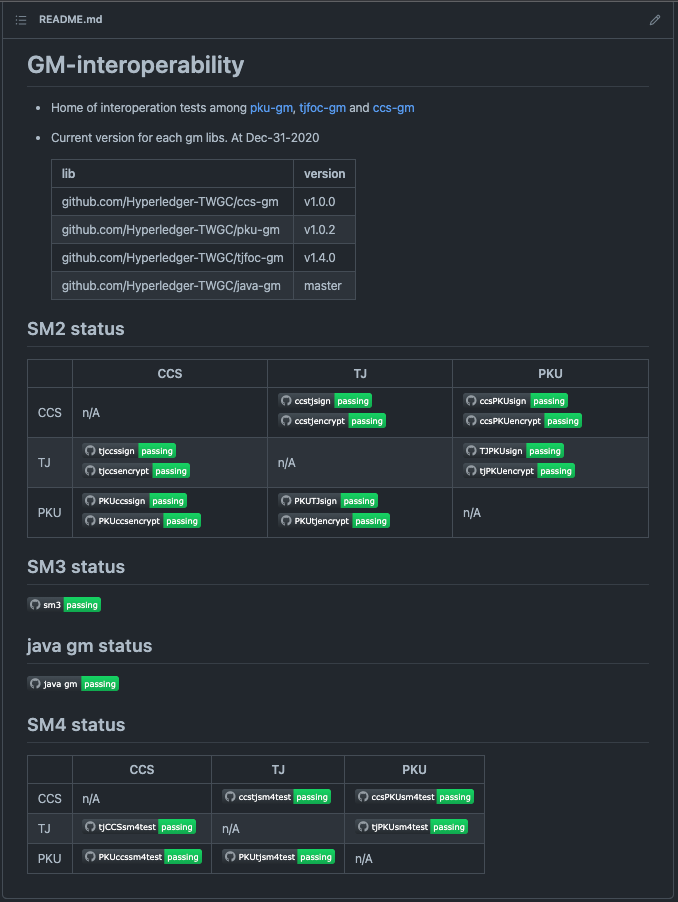

## 项目背景和目标

密码是解决网络与信息安全最有效、最可靠、最经济的方式，是维护网络与信息安全的核心技术和基础支撑。

国密算法是国家通用密码算法的简称，是国家密码管理局制定的自主可控的国产算法，包括SM1、SM2、SM3 、SM4、SM7、SM9、祖冲之密码算法（ZUC)等。

密码算法在区块链系统中起着举足轻重的作用，这对于Hyperledger Fabric来说也不例外。Hyperledger Fabric是具有国际影响力的企业级区块链平台，其默认密码算法为国际标准密码算法，但是对世界各国企业而言，区块链项目存在根据行业规范或当地法律法规调整加密算法或实施细节的需要。另外，Fabric的密码套件虽然是可插拔式的，但是密码算法扩展性上还是存在一些限制。为了更好地推进Hyperlegder Fabric项目对不同加密算法实现的支持，降低企业使用其作为区块链解决方案时对于密码套件改造可能的二次开发成本，提高国际化友好性，Fabric国密改造项目应运而生。Fabric国密改造项目由Hyperlegder中国工作组（TWGC）发起执行，旨在构建支持国密算法且密码算法可灵活扩展的Fabric平台，方便世界各国开发者快速接入自定义的密码算法。

本文旨在介绍TWGC hyperledger fabric国密改造小组自2020年6月17日成立后，各位社区开发者2022年贡献代码和参与讨论相关话题，方便感兴趣的朋友能够了解截止目前2022年本项目的状态。

## 基础库通用方案和讨论
对于各个基础库的通用方案和讨论基本围绕以下几点展开，这里也是社区和工作小组中大家广泛讨论和关心的问题：

- pkcs#8
经过国密小组商讨和研究，对于各个基础库，我们目前采用并已经统一实现了基于pkcs#8的密钥/证书导入导出标准。

- ci中加benchmark
大家普遍关心国密改造后是否会带来性能问题，因此国密工作组与性能工作组合作，在各个golang的国密基础库上添加了benchmark测试和对于内存泄漏在内的性能相关检测工作。以期待通过国密算法对比Fabric本身的算法在密码学操作（散列/加密/解密/签名/验证）上的性能对比，从而回答国密算法改造对于Fabric本身的性能影响，以及验证各个国密基础库的算法运行效率。并且我们对于各个国密库的一些性能相关问题进行了部分优化工作。

- 汇编加速有关的讨论
目前在部分基础库代码实现层面，涉及到一些汇编优化方案。由于arm有限制，因此也带来了一些讨论和问题。
比如社区朋友有希望在不同CPU架构下实现国密算法改造，因为汇编实现而不兼容的情况。考虑作为社区项目很难兼容到到不同CPU架构，主要是设备兼容问题，我们将会维持目前的CPU架构的支持策略。

- 我们在2022年上班年，开始将各个国密库迁移到github action上作为ci工具以替代azure pipeline。

## 基础库目前进展状况

总体来看，我们在各个国密基础库的功能完善，性能优化，和bug fix上均有不同程度的进展。具体的细节请大家参考各个国密库的发行日志。这里只给出状态表如下：

| 国密基础库    | SM2    | SM3    | SM4    | TLS    |
| ------------ | ------ | ------ | ------ | ------ |
| 北大国密库    | 成熟   | 成熟   | 成熟    |        |
| 网安国密库    | 成熟   | 成熟   | 成熟    |  孵化   |
| 同济国密库    | 成熟   | 成熟   | 成熟    |        |
| Java国密库    | 成熟  | 成熟   | 成熟    |  孵化   |
| NodeJS国密库  | beta | 孵化     |       |        |

> **成熟**：可以使用，并且包含了项目内部单元测试和互操作测试。  
> **beta**：功能待完善，开发过程中。  
> **孵化**：调研中。  

备注：2022年上半年，我们将几个主要国密库进行了依赖升级，以及对于java国密库添加了部分新增功能以方便使用。

## 基础库之间的互操作认证

如图，我们在项目GM-interop我们主要完成了
- 与java 国密库互操作认证
- 主要国密库之间的SM2/SM3的互操作验证
- SM4相关的互操作认证工作(ecb以及cbc模式)

后续工作
- 准备移除bccsp以及interface

有关TLS互操作测试部分
- tjfoc-gm tls双证书测试成功
- tjfoc-gm tls单证书测试失败
- ccs-gm tls双证书测试成功
- ccs-gm tls单证书测试成功
- ccs-gm和tjfoc-gm双证书互操作失败 

## Fabric-CA改造
Fabric-CA目前使用"硬改"方案改造已经完成，使用了[ccs-gm](https://github.com/Hyperledger-TWGC/ccs-gm)和[net-go-gm基础库](https://github.com/Hyperledger-TWGC/net-go-gm)。实现功能和特点如下：

- 支持国密算法，能够生成基于国密算法x509格式证书
- API调用支持基于国密算法https通讯
- 改造非“侵入式”，API保持与原有官方使用方式高度一致

## Fabric改造进度以及RFC推进
12月8日，我们就国密改造的RFC和Fabric的维护者进行了交流，[视频回放](https://wiki.hyperledger.org/display/fabric/Contributor+Meetings+2021)
另外我们还持续在[邮件列表](https://lists.hyperledger.org/g/fabric/topic/about_bccsp_plugin/87727331?p=,,,20,0,0,0::recentpostdate/sticky,,,20,2,0,87727331,previd=1640209942982555107,nextid=1639497604009558838&previd=1640209942982555107&nextid=1639497604009558838)与[RFC](https://github.com/hyperledger/fabric-rfcs/pull/34)中与国内外的贡献者进行讨论。
目前改造的[代码分支](https://github.com/Hyperledger-TWGC/fabric/tree/bccsp-gm) 目前我们在RFC中提出了一种新的改造方式。

### 新的改造方式
经调查，我们发现bccsp库和msp库都依赖于x509库，且msp库依赖于bccsp库作为底层实现。因此在新的改造方式下，我们首先将msp库中对于x509的依赖整合到bccsp库中，使得msp库在上层服务于fabric内部的设计和抽象，bccsp成为中间适配器的作用，对msp库提供技术支撑同时对底层不同的加密算法和hash算法进行匹配。

## Workshop
为普及和推广超级账本TWGC国密工作成果，帮助用户使用Hyperledger Fabric的国密库，加速开发效率，超级账本TWGC国密组于10月30日举办了第一期国密线上研习班。本次活动由超级账本TWGC主办，中国信息通信研究院和树根格致协办。
[视频回放](https://www.bilibili.com/video/BV1zU4y1T7XR?spm_id_from=333.999.0.0)

## 下一步工作计划
在进一步完善国密基础库的基础上进行开源国密改造工作，以推动RFC在社区的工作进度。
同时鉴于fabric 2.4 release的临近，我们正在筹备针对2.4版本对应gateway新型sdk的国密钱包工作。
欢迎大家踊跃贡献。

## 参与国密改造项目你将收获

- 个人

  - 一群志同道合的朋友
  - 技术能力提升
  - 开源项目经验
  - 大平台的交流机会，比如[在超级账本全球论坛上分享《TWGC国密改造小组的旅程故事》](https://github.com/Hyperledger-TWGC/fabric-gm-wiki/blob/master/%E4%BC%9A%E8%AE%AE%E8%AE%B0%E5%BD%95/A%20journey%20with%20the%20TWGC%20CryptoGraphy%20Team%20-%20David%20Liu%2C%20Oracle.pdf)

- 企业

  - 认知度提升
  - 更多的合作机会
  - 更好的人才储备

Fabric国密改造项目是由Hyperledger TWGC发起执行的开源项目，需要对该项目感兴趣的开发者一起协作完成。我们TWGC现已招募到了50+项目志愿者。
欢迎企业或个人参与Fabric国密改造项目，为开源社区贡献自己的一份力量。人人为我，我为人人。

### 联系方式
-------------
- [加入TWGC Github组织, 给国密项目做出代码贡献](https://github.com/Hyperledger-TWGC) 
- 国密讨论微信群：微信联络David Liu（davidkhala），Sam Yuan（oe19901019），肖慧（luoyu_276354421）进群。
- [TWGC在Hyperledger的联系渠道](https://wiki.hyperledger.org/display/TWGC/Technical+Working+Group+China)
- [参加国密改造周例会](https://github.com/Hyperledger-TWGC/fabric-gm-wiki/wiki/%E6%AF%8F%E5%91%A8%E4%BE%8B%E4%BC%9A%E4%BF%A1%E6%81%AF)

### 参考链接
-------------
北京大学信息安全实验室 GMSSL 系列
https://github.com/Hyperledger-TWGC/pku-gm

中国网安 CCS-GM 系列
https://github.com/Hyperledger-TWGC/ccs-gm

苏州同济区块链研究院 tjfoc-gm
https://github.com/Hyperledger-TWGC/tjfoc-gm

java-gm
https://github.com/Hyperledger-TWGC/java-gm

node-gm
https://github.com/Hyperledger-TWGC/node-gm

向Fabric社区提交了有关bccsp的改造方案的RFC文档
https://github.com/hyperledger/fabric-rfcs/pull/34